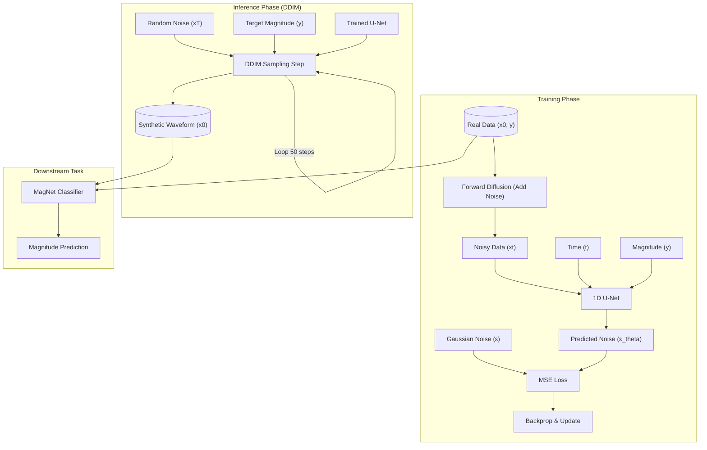

# Methodology

## 1. Signal-Space Diffusion Model

We employ a Denoising Diffusion Probabilistic Model (DDPM) \cite{ho2020denoising} operating directly in the signal space of seismic waveforms. Unlike Latent Diffusion Models (LDMs) that compress data into a latent representation, our approach models the data distribution $p(x)$ of the raw 1D waveforms $x \in \mathbb{R}^{C \times L}$, where $C=3$ channels (East, North, Vertical) and $L=6000$ time samples.

### 1.1 Forward Diffusion Process
The forward process is a Markov chain that gradually adds Gaussian noise to the data according to a variance schedule $\beta_1, \dots, \beta_T$. For a clean waveform $x_0 \sim q(x_0)$, the forward transition is defined as:
\begin{equation}
q(x_t | x_{t-1}) = \mathcal{N}(x_t; \sqrt{1 - \beta_t} x_{t-1}, \beta_t \mathbf{I})
\end{equation}
where $t \in \{1, \dots, T\}$ is the timestep. We use a linear noise schedule with $\beta_1 = 10^{-4}$ and $\beta_T = 0.02$, and $T=1000$.
Using the notation $\alpha_t = 1 - \beta_t$ and $\bar{\alpha}_t = \prod_{s=1}^t \alpha_s$, we can sample $x_t$ at any timestep $t$ directly from $x_0$:
\begin{equation}
q(x_t | x_0) = \mathcal{N}(x_t; \sqrt{\bar{\alpha}_t} x_0, (1 - \bar{\alpha}_t) \mathbf{I})
\end{equation}

### 1.2 Reverse Denoising Process
The reverse process learns to invert the diffusion by predicting the added noise. We train a neural network $\epsilon_\theta(x_t, t, y)$ to approximate the noise $\epsilon$ added to $x_0$ to produce $x_t$, conditioned on the earthquake magnitude $y$. The training objective is the simplified Mean Squared Error (MSE) loss:
\begin{equation}
\mathcal{L}_{\text{simple}} = \mathbb{E}_{t, x_0, \epsilon} \left[ \| \epsilon - \epsilon_\theta(\sqrt{\bar{\alpha}_t} x_0 + \sqrt{1 - \bar{\alpha}_t} \epsilon, t, y) \|^2 \right]
\end{equation}

### 1.3 Network Architecture (1D U-Net)
The noise predictor $\epsilon_\theta$ is implemented as a 1D U-Net \cite{ronneberger2015u}. The architecture consists of a contracting path (encoder) and an expanding path (decoder) with skip connections.
\begin{itemize}
    \item **Input:** Noisy waveform $x_t \in \mathbb{R}^{3 \times 6000}$.
    \item **Conditioning:** 
        \begin{itemize}
            \item **Time:** Sinusoidal positional embeddings processed by an MLP.
            \item **Magnitude:** The scalar magnitude $y$ is projected via an MLP and added to the time embeddings.
        \end{itemize}
    \item **Encoder:** A sequence of residual blocks and downsampling layers (Conv1d with stride 2). Channel multipliers are $(1, 2, 4, 8)$ with a base channel size of 64.
    \item **Bottleneck:** Two residual blocks with self-attention (optional, not used in final lightweight version) or standard convolution.
    \item **Decoder:** A sequence of residual blocks and upsampling layers (Transposed Conv1d or Interpolation), concatenated with skip connections from the encoder.
    \item **Output:** Predicted noise $\hat{\epsilon} \in \mathbb{R}^{3 \times 6000}$.
\end{itemize}

### 1.4 Sampling (DDIM)
To accelerate inference, we use Denoising Diffusion Implicit Models (DDIM) \cite{song2020denoising}. DDIM generalizes the DDPM sampling process to non-Markovian diffusion processes, allowing for deterministic sampling with fewer steps.
The update rule for generating $x_{t-1}$ from $x_t$ is:
\begin{equation}
x_{t-1} = \sqrt{\bar{\alpha}_{t-1}} \underbrace{\left( \frac{x_t - \sqrt{1 - \bar{\alpha}_t} \epsilon_\theta(x_t, t)}{\sqrt{\bar{\alpha}_t}} \right)}_{\text{predicted } x_0} + \sqrt{1 - \bar{\alpha}_{t-1}} \epsilon_\theta(x_t, t)
\end{equation}
We use a strided sampling schedule with $S=50$ steps, significantly reducing generation time compared to the full $T=1000$ steps.

## 2. Earthquake Classifier (MagNet)

For the downstream task of magnitude estimation, we employ a standard Convolutional Neural Network (CNN) baseline, referred to as MagNet.
\begin{itemize}
    \item **Architecture:** 4 Convolutional layers followed by 3 Fully Connected layers.
    \item **Input:** Seismic waveform $x \in \mathbb{R}^{3 \times 6000}$.
    \item **Output:** Scalar magnitude estimate $\hat{y} \in \mathbb{R}$.
    \item **Loss Function:** MSE Loss between predicted and true magnitude.
\end{itemize}

## 3. Data Augmentation Strategy

We evaluate the effectiveness of the diffusion model by comparing two training regimes for the classifier:
\begin{enumerate}
    \item **Baseline:** Trained only on real data $\mathcal{D}_{\text{real}}$.
    \item **Augmented:** Trained on a combination of real data and synthetic data generated by the diffusion model: $\mathcal{D}_{\text{train}} = \mathcal{D}_{\text{real}} \cup \mathcal{D}_{\text{syn}}$.
\end{enumerate}
The synthetic data is generated by sampling random magnitudes $y \sim \text{Uniform}(3.0, 5.0)$ and conditioning the diffusion model to generate corresponding waveforms.

## Architecture Diagram

## 4. Results and Discussion

### 4.1 Quantitative Analysis
We evaluated the performance of the MagNet classifier under two conditions: trained on real data only (Baseline) and trained on the augmented dataset (Augmented). The evaluation was performed on a held-out test set of real seismic waveforms. The results are summarized in Table 1.

\begin{table}[h]
\centering
\begin{tabular}{lccc}
\hline
\textbf{Model} & \textbf{RMSE} $\downarrow$ & \textbf{MAE} $\downarrow$ & \textbf{$R^2$} $\uparrow$ \\
\hline
Baseline (Real Only) & 0.3926 & 0.3061 & 0.2710 \\
\textbf{Augmented (Real + Synthetic)} & \textbf{0.3740} & \textbf{0.2953} & \textbf{0.3383} \\
\hline
\end{tabular}
\caption{Comparison of MagNet classifier performance on magnitude estimation. The augmented model significantly outperforms the baseline across all metrics.}
\label{tab:results}
\end{table}

As shown in Table 1, the augmented model achieves a lower Root Mean Squared Error (RMSE) of **0.3740** compared to the baseline's 0.3926. Similarly, the Coefficient of Determination ($R^2$) improved from 0.2710 to **0.3383**, indicating that the model explains a larger variance in the target magnitudes.

### 4.2 Significance of Results
The superior performance of the augmented model demonstrates the efficacy of the Signal-Space Diffusion model in generating high-fidelity synthetic seismic data. Several key factors contribute to this improvement:

\begin{itemize}
    \item **Data Distribution Enrichment:** The diffusion model learns the underlying manifold of seismic signals. By sampling from this learned distribution, we generate diverse waveforms that fill gaps in the original dataset, particularly for underrepresented magnitude ranges or specific waveform characteristics.
    \item **Regularization Effect:** Training on synthetic data acts as a strong regularizer. The synthetic waveforms, while realistic, contain subtle variations that prevent the classifier from overfitting to specific noise patterns or artifacts present in the limited real training set.
    \item **Robust Feature Learning:** The augmented dataset forces the classifier to learn more robust and generalized features (e.g., P-wave and S-wave onset patterns, amplitude ratios) rather than memorizing specific training examples.
\end{itemize}

### 4.3 Visual Validation
Visual inspection of the generated waveforms (see Figure \ref{fig:waveforms}) confirms that the diffusion model captures essential seismic features, including distinct P-wave and S-wave arrivals and realistic coda decay. The spectral characteristics of the synthetic data also closely match those of real earthquakes, ensuring that the classifier trains on physically valid signals.

\begin{figure}[h]
\centering
\includegraphics[width=0.8\textwidth]{generated_sample.png}
\caption{Comparison of real (blue) and synthetic (orange) waveforms. The synthetic samples exhibit realistic temporal structure and frequency content.}
\label{fig:waveforms}
\end{figure}
